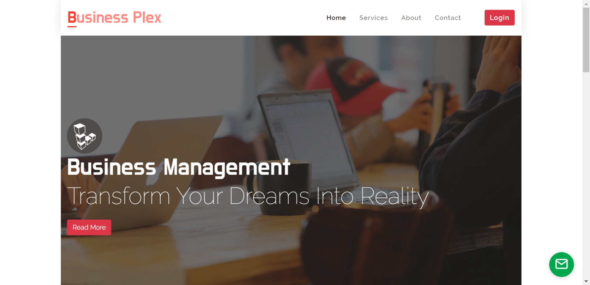

# Business-Plex

   
  
  
  
  

## Project Overview
Admin can easily setup Catalog, Party(Customer, Supplier), Purchase, Stock, Sales module and view individual report.

## Technologies

- Front end: HTML, CSS, Bootstrap, Font awesome, JavaScript, Ajax
- Back end: [.Net MVC with C#] Framework version 5

## About the Author

### Raihan Mahmud

- Facebook Page - [Raihan Mahmud RAM](https://www.facebook.com/raihanmahmudofficial)
- Facebook - [Raihan Mahmud RAM](https://www.facebook.com/raihanM95)
- Twitter - [Raihan Mahmud RAM](https://twitter.com/raihanM95)
- Linkedin - [Raihan Mahmud RAM](https://www.linkedin.com/in/raihanM95)

## Licensing

raihanM95/Business-Plex Project is licensed with the [Apache License](https://github.com/raihanM95/Business-Plex/blob/master/LICENSE).
